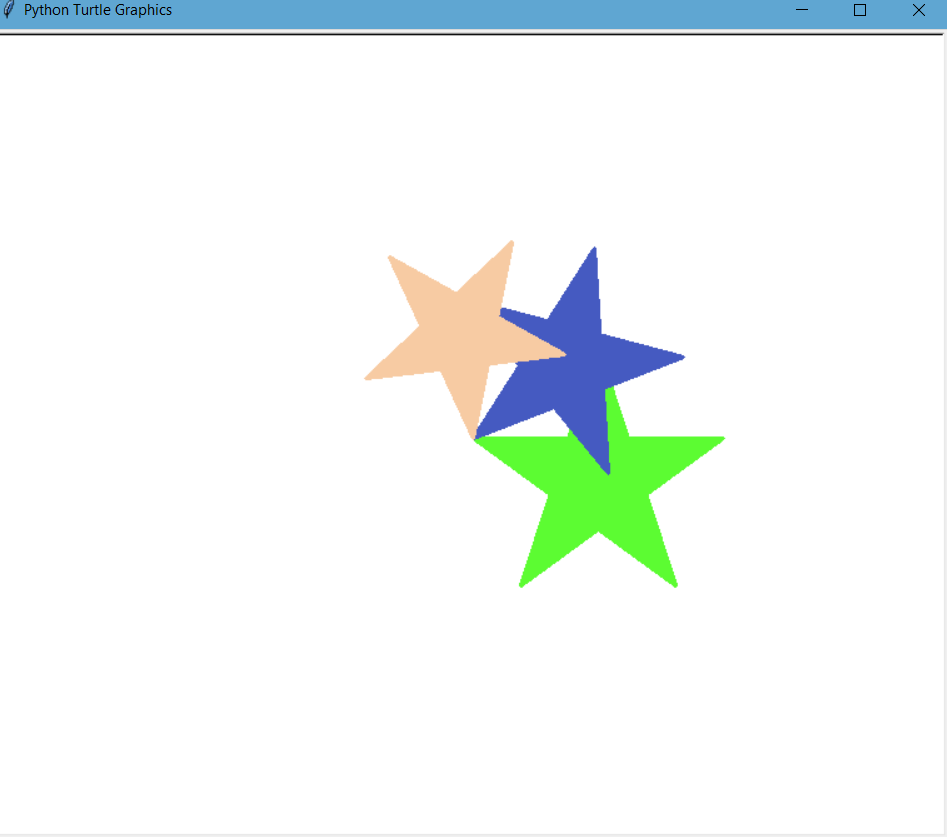
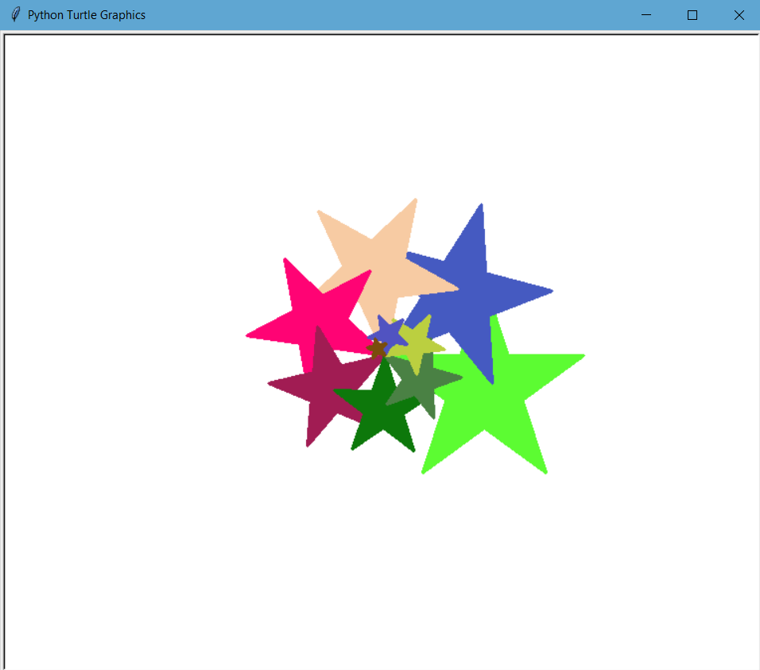

# Star Animation with python Turtle
A python program that simulates simple animation of a star.
The star begins with a set size (length of each side) and keeps rotating anticlockwise on the Turtle screen while 
each star decreasing in size

## Installation
Use the clone [link](https://github.com/caykay/AnimatedStar) provided, to clone this project.
```bash
git clone https://github.com/caykay/AnimatedStar.git
```
Use the package manager [pip](https://pip.pypa.io/en/stable/) to install all required packages/modules.

```bash
pip install -r requirements.txt
```

## Changing the star size
To change the star size, the initial length needs to be adjusted.

To do this, simply specify the initial length as an argument in the _animation_ function
```python
animation(400)
```

## Changing the number of rounds
You can alter the number of times the star is animated
by including another argument called rounds by default _rounds = 10_
```python
# Example
animation(size=400, rounds=20)
```

## Animation example
| At start      | At end      |
|------------|-------------|
|||
